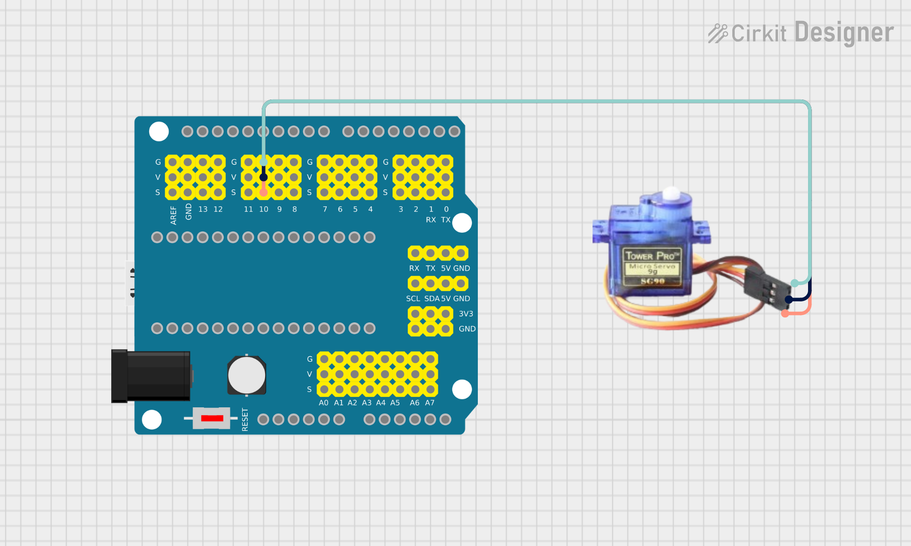
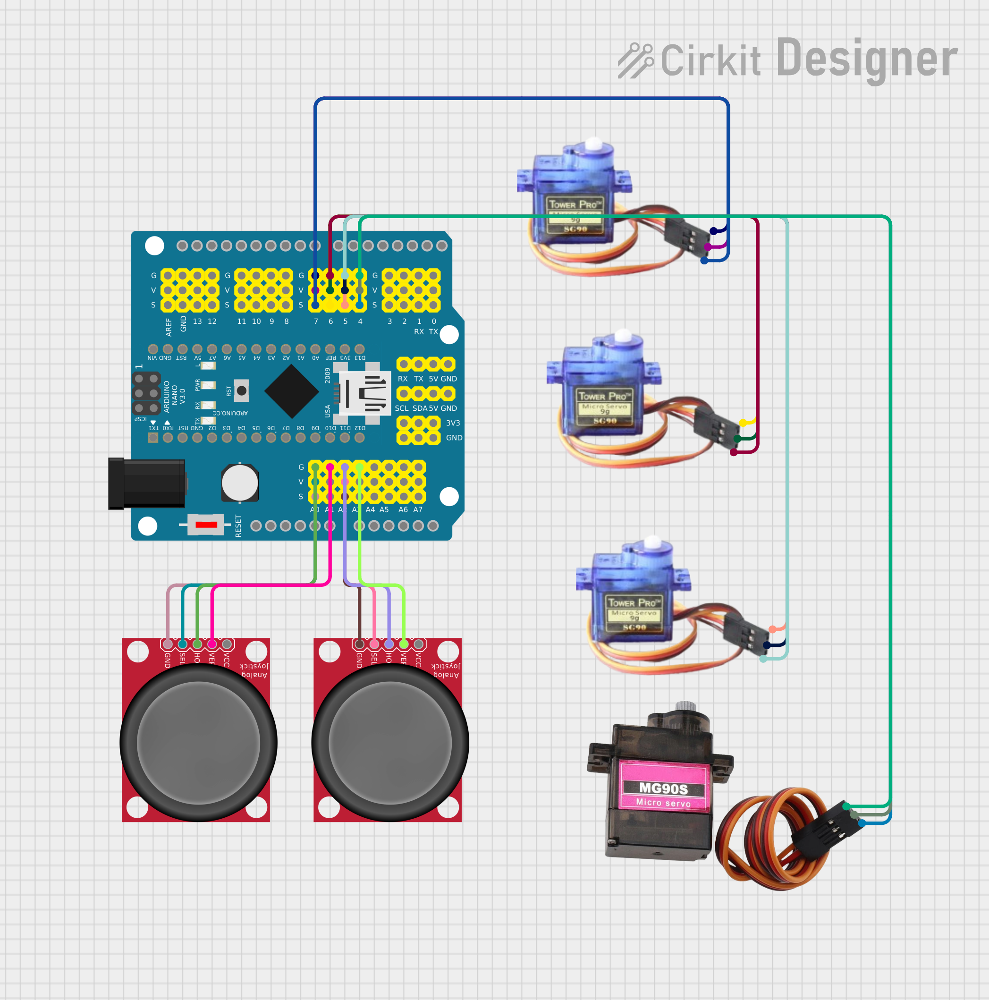

# Three Jointed Robotic Arm

<!--- Replace this text with a brief description (2-3 sentences) of your project. This description should draw the reader in and make them interested in what you've built. You can include what the biggest challenges, takeaways, and triumphs from completing the project were. As you complete your portfolio, remember your audience is less familiar than you are with all that your project entails! -->


| **Engineer** | **School** | **Area of Interest** | **Grade** |
|:--:|:--:|:--:|:--:|
| Anvi G | Windmere Ranch Middle School | Computer Science | Incoming 7th Grader

**Replace the BlueStamp logo below with an image of yourself and your completed project. Follow the guide [here](https://tomcam.github.io/least-github-pages/adding-images-github-pages-site.html) if you need help.**


  
# Final Milestone

<iframe width="560" height="315" src="https://www.youtube.com/embed/krs4Uhe47pU?si=V2H86m1XvKa2m2kH" title="YouTube video player" frameborder="0" allow="accelerometer; autoplay; clipboard-write; encrypted-media; gyroscope; picture-in-picture; web-share" referrerpolicy="strict-origin-when-cross-origin" allowfullscreen></iframe> 

 ## Description

 For my third milestone, I upgraded the robotic arm I built in Milestone 2 by adding joystick control. This means that instead of using buttons or uploading new code every time I want the arm to move, I can now control it in real time just by using a joystick! This is a huge improvement because it makes the arm easier to use and more fun to operate.

The robotic arm uses two joysticks, one on the left and one on the right. The left joystick controls the base and the bending of the arm. When I push the joystick up, the arm bends backward. When I move it down, the arm moves forward. Moving the joystick to the left turns the base of the arm to the right, and moving it to the right turns the base to the left. The right joystick controls the claw. Pushing it left opens the claw, and pushing it right closes it.

The code that controls the arm uses a special library made for the robotic arm. It constantly reads the position of both joysticks, checking whether they are being pushed in any direction. If they are, the code sends commands to the motors to move certain parts of the arm. For example, if the left joystick is pushed up, the code runs a function, which makes the upper part of the arm move upward at a certain speed. 

## Challenges

  One of the hardest parts of this project was getting the servos to move when I used the joystick. At first, I thought the code was wrong or the servos were broken, because nothing was moving. So, I took apart the whole robotic arm and tested each servo one at a time using a simple program. They all worked fine. That’s when I figured out the real problem was the batteries. I haad not fully pushed in the batteries and after I pushed the battries in better the joystick started to move the arm.

Another problem was that after I rebuilt the arm, it was loose and wobbly. Some joints weren’t tight enough, and some servos didn’t fit perfectly into the arm parts. Some servo arms were too big or didn’t line up with the screw holes. I had to figure out which servos worked best with each part and tighten all the screws really well. After swapping the servo arm everything fit in properly and the joints were in properly.

I also had trouble with the buzzer. When I turned everything on, the buzzer made a loud buzzing noise. I checked the code and saw that the buzzer was turning on because the on the code it had set the buzzer to be high. So what I did to fix it was I changed the volume from high to low.  After that, the buzzer worked the way it should.


# Second Milestone

<iframe width="560" height="315" src="https://www.youtube.com/embed/oB7ArvjD6FY?si=KT3m7q0Yzt7fWj95" title="YouTube video player" frameborder="0" allow="accelerometer; autoplay; clipboard-write; encrypted-media; gyroscope; picture-in-picture; web-share" referrerpolicy="strict-origin-when-cross-origin" allowfullscreen></iframe>

## Description 

For my second milestone, I built a robotic arm with four servo motors. Each motor moves a different part of the arm: one turns the base, one lifts the bottom part, one moves the middle joint, and the last one controls the claw at the top. I carefully mounted the servos to match the arm's joints so each one could move a specific section. 

To make the servos move later, I connected each one to the Arduino. Servo motors need three wires: power (red), ground (black), and signal (white). The signal wires tell the servo what angle to turn to, so I connected those to specific digital pins on the Arduino that support PWM: Servo 1 to pin 7, Servo 2 to pin 6, Servo 3 to pin 5, and Servo 4 to pin 4. 

I also wired up a joystick to control the robotic arm. The joystick has two axes — X and Y — that detect movement when I push the stick left/right or up/down. These axes are connected to analog pins A0 and A1 on the Arduino so it can read the movement values. I also connected the joystick’s its GND pin to ground. In my next milestone, I’ll write the code that reads the joystick's input and moves the servos to match, so I can control the robotic arm by simply moving the joystick.

## Challenges

  During this Milestone I had a couple of challenges like first I could not fit a piece into another one so I had to sandpaper it down so it would fit. Another challenge that I had was that I didn't screw a screw in properly so because of that the arm was not stable and would not stand on it's own.

## Next Steps

  For my next Milestone I am going to finish coding my robotic arm so it can move whenever I move the joystick.
  


# First Milestone

<iframe width="560" height="315" src="https://www.youtube.com/embed/kOTR2lKDriY?si=Tf3gUGSXZySFV1TE" title="YouTube video player" frameborder="0" allow="accelerometer; autoplay; clipboard-write; encrypted-media; gyroscope; picture-in-picture; web-share" referrerpolicy="strict-origin-when-cross-origin" allowfullscreen></iframe>

## Description

For my first milestone, I started by testing all the parts to make sure they were working. I used parts like servos (which help things move), a joystick, an IR sensor, and a Nano Shield. I plugged them into my computer and used simple programs to check that each part responded the way it was supposed to. This step is important so I don’t run into surprises later when building the full project.

One of the first parts I tested was the joystick. I wrote code that let the joystick control how the servos moved. The servos use something called a PWM signal, which stands for "Pulse Width Modulation." It just means the power quickly turns on and off to make the servo move to the correct angle. I connected the signal wire from the servo to pin number 7 on the Nano Shield. When I moved the joystick, the servo would move too, which showed me it was working correctly using my code.

Next, I tested the IR sensor. This sensor lets the Arduino read signals from a remote control—kind of like a TV remote works. I uploaded a code that could read and show the number sent by each button press. When I pressed a button on the remote, I saw a number pop up on the serial monitor on my computer. That told me the IR sensor was receiving signals correctly and was ready to be used for controlling the robot in the next steps.

## Challenge
A challenge that I had was that I had to connect two wires together and then when I was heat shrinking the plastic I accidentally burned the wires. I also had problems with the IR sensor. After I uploaded the code to the sensor it wouldn't write the number onto the sieral monitor. To fix it I relized it had to use a remote to test the sensor.

## Next Steps
My plan to finish the project is that first I will build the arm and then after building the arm I will code it.


# Starter Project
 
<iframe width="560" height="315" src="https://www.youtube.com/embed/EDjiuEoxJuI?si=wos0XdUu4kA3OXpi" title="YouTube video player" frameborder="0" allow="accelerometer; autoplay; clipboard-write; encrypted-media; gyroscope; picture-in-picture; web-share" referrerpolicy="strict-origin-when-cross-origin" allowfullscreen></iframe>

  This is an RGB Slider and it works by first plugging it into a power source. Then using the sliders the colors change. For example when you slide the red slider the the intensity of the color red increases and becomes red, same for the other two sliders. What I did was solder the sliders onto the main chip and also added the power source to the card. Overall this project was simple and helped me learn how to solder and how LEDs work.


# Schematics

## Milestone 1



## Milestone 2



# Code 

## Milestone 1

### Servo Testing

```c++
void loop() {
  // put your main code here, to run repeatedly: #include<Servo.h>
Servo myservo;  // create servo object to control a servo
                 // a maximum of eight servo objects can be created  
int pos = 0;     // variable to store the servo position
void setup()
{
myservo.attach(10);  // attaches the servo on pin 10 to the servo object
}
void loop()
{
for(pos=0;pos<180;pos+=1)  // goes from 0 degrees to 180 degrees 
{
 myservo.write(pos); // tell servo to go to position in variable 'pos'
 delay(15);  // waits 15ms for the servo to reach the position
}
for(pos = 180;pos>=1;pos-=1)  // goes from 180 degrees to 0 degrees
 {
 myservo.write(pos); // tell servo to go to position in variable 'pos' 
 delay(15);  //waits 15ms for the servo to reach the position
 }
}
```
### Joystick Testing

```c++
void setup() { 
pinMode(3, INPUT); 
Serial.begin(9600); 
} 
void loop(){
int value = 0; 
value = analogRead(A0); 
Serial.print("X:"); 
Serial.print(value, DEC); 
value = analogRead(A1); 
Serial.print(" | Y:"); 
Serial.print(value, DEC); 
value = digitalRead(3); 
Serial.print(" | Z: "); 
Serial.println(value, DEC); 
delay(100); 
}
```

### NANO Shield Testing
```c++
#include <IRremote.h>
int RECV_PIN = 8;
IRrecv irrecv(RECV_PIN);
decode_results results;
void setup()
{
  Serial.begin(9600);
  irrecv.enableIRIn(); // Start the receiver
}
void loop() {
  if (irrecv.decode(&results)) {
    Serial.println(results.value, HEX);
    irrecv.resume(); // Receive the next value
  }
}
```
## Milestone 3

### Arm

```c++
This code applies to cokoino mechanical arm
 * Through this link you can download the source code:
 * https://github.com/Cokoino/CKK0006
 * Company web site:
 * http://cokoino.com/
 *                                     ________
 *                         ----|servo4| 
 *                        |            --------
 *                    |servo3|   
 *                        |
 *                        |
 *                    |servo2|
 *                        |
 *                        |
 *                  ___________
 *                  |  servo1 |
 *         ____________________
 *         ____________________
 * Fanctions:
 * arm.servo1.read();   //read the servo of angle
 * arm.servo2.read();
 * arm.servo3.read();
 * arm.servo4.read();
 * 
 * arm.servo1.write(angle);   //servo run
 * arm.servo2.write(angle);
 * arm.servo3.write(angle);
 * arm.servo4.write(angle);
 * 
 * arm.left(speed);    //perform the action 
 * arm.right(speed);
 * arm.up(speed);
 * arm.down(speed);
 * arm.open(speed);
 * arm.close(speed);
 * 
 * arm.captureAction();    //capture the current action,return pointer array
 * arm.do_action(int *p,int speed);  //P is a pointer to the array
 * 
 * arm.JoyStickL.read_x(); //Returns joystick numerical
 * arm.JoyStickL.read_y();
 * arm.JoyStickR.read_x();
 * arm.JoyStickR.read_y();
 */
#include "src/CokoinoArm.h"
#define buzzerPin 9

CokoinoArm arm;
int xL,yL,xR,yR;

const int act_max=170;    //Default 10 action,4 the Angle of servo
int act[act_max][4];    //Only can change the number of action
int num=0,num_do=0;
///////////////////////////////////////////////////////////////
void turnUD(void){
  if(xL!=512){
    if(0<=xL && xL<=100){arm.up(10);return;}
    if(900<xL && xL<=1024){arm.down(10);return;} 
    if(100<xL && xL<=200){arm.up(20);return;}
    if(800<xL && xL<=900){arm.down(20);return;}
    if(200<xL && xL<=300){arm.up(25);return;}
    if(700<xL && xL<=800){arm.down(25);return;}
    if(300<xL && xL<=400){arm.up(30);return;}
    if(600<xL && xL<=700){arm.down(30);return;}
    if(400<xL && xL<=480){arm.up(35);return;}
    if(540<xL && xL<=600){arm.down(35);return;} 
    }
}
///////////////////////////////////////////////////////////////
void turnLR(void){
  if(yL!=512){
    if(0<=yL && yL<=100){arm.right(0);return;}
    if(900<yL && yL<=1024){arm.left(0);return;}  
    if(100<yL && yL<=200){arm.right(5);return;}
    if(800<yL && yL<=900){arm.left(5);return;}
    if(200<yL && yL<=300){arm.right(10);return;}
    if(700<yL && yL<=800){arm.left(10);return;}
    if(300<yL && yL<=400){arm.right(15);return;}
    if(600<yL && yL<=700){arm.left(15);return;}
    if(400<yL && yL<=480){arm.right(20);return;}
    if(540<yL && yL<=600){arm.left(20);return;}
  }
}
///////////////////////////////////////////////////////////////
void turnCO(void){
  if(xR!=512){
    if(0<=xR && xR<=100){arm.close(0);return;}
    if(900<xR && xR<=1024){arm.open(0);return;} 
    if(100<xR && xR<=200){arm.close(5);return;}
    if(800<xR && xR<=900){arm.open(5);return;}
    if(200<xR && xR<=300){arm.close(10);return;}
    if(700<xR && xR<=800){arm.open(10);return;}
    if(300<xR && xR<=400){arm.close(15);return;}
    if(600<xR && xR<=700){arm.open(15);return;}
    if(400<xR && xR<=480){arm.close(20);return;}
    if(540<xR && xR<=600){arm.open(20);return;} 
    }
}
///////////////////////////////////////////////////////////////
void date_processing(int *x,int *y){
  if(abs(512-*x)>abs(512-*y))
    {*y = 512;}
  else
    {*x = 512;}
}
///////////////////////////////////////////////////////////////
void buzzer(int H,int L){
  while(yR<420){
    digitalWrite(buzzerPin,LOW);
    delayMicroseconds(H);
    digitalWrite(buzzerPin,LOW);
    delayMicroseconds(L);
    yR = arm.JoyStickR.read_y();
    }
  while(yR>600){
    digitalWrite(buzzerPin,LOW);
    delayMicroseconds(H);
    digitalWrite(buzzerPin,LOW);
    delayMicroseconds(L);
    yR = arm.JoyStickR.read_y();
    }
}
///////////////////////////////////////////////////////////////
void C_action(void){
  if(yR>800){
    int *p;
    p=arm.captureAction();
    for(char i=0;i<4;i++){
    act[num][i]=*p;
    p=p+1;     
    }
    num++;
    num_do=num;
    if(num>=act_max){
      num=0;
      buzzer(600,400);
      }
    while(yR>600){yR = arm.JoyStickR.read_y();}
    //Serial.println(act[0][0]);
  }
}
///////////////////////////////////////////////////////////////
void Do_action(void){
  if(yR<220){
    buzzer(200,300);
    for(int i=0;i<num_do;i++){
      arm.do_action(act[i],15);
      }
    num=0;
    while(yR<420){yR = arm.JoyStickR.read_y();}
    for(int i=0;i<2000;i++){
      digitalWrite(buzzerPin,LOW);
      delayMicroseconds(200);
      digitalWrite(buzzerPin,LOW);
      delayMicroseconds(300);        
    }
  }
}
///////////////////////////////////////////////////////////////
void setup() {
  //Serial.begin(9600);
  //arm of servo motor connection pins
  arm.ServoAttach(4,5,6,7);
  //arm of joy stick connection pins : xL,yL,xR,yR
  arm.JoyStickAttach(A0,A1,A2,A3);
  pinMode(buzzerPin,OUTPUT);
  Serial.begin(9600); 
}
///////////////////////////////////////////////////////////////
void loop() {
  xL = arm.JoyStickL.read_x();
  yL = arm.JoyStickL.read_y();
  xR = arm.JoyStickR.read_x();
  yR = arm.JoyStickR.read_y();
  date_processing(&xL,&yL);
  date_processing(&xR,&yR);
  turnUD();
  turnLR();
  turnCO();
  //C_action();
  //Do_action();

  Serial.print("xL:"); 
Serial.print(xL, DEC);
Serial.print("yL:"); 
Serial.print(yL, DEC);
Serial.print("xR:"); 
Serial.print(yR, DEC);
Serial.print("xR:"); 
Serial.println(xR, DEC);
}


```
 # How It Works

## Servos

  A servo is a small motor that can move things, like arms or wheels, to a certain angle or position. It’s super useful in robots because it can turn exactly how much you want it to. Servos use something called PWM (Pulse Width Modulation) to control their movement. That just means it gets a signal that tells it how far to turn. For example, if you want a robot arm to lift up halfway, you can tell the servo to turn 90 degrees. Servos are different from regular motors because they are really good at stopping in the exact spot you want!
  
## PWM

PWM stands for Pulse Width Modulation. It’s a way to control how much power something gets by turning the signal on and off really fast. Even though it’s switching on and off quickly, it tricks the motor or light into thinking it’s getting less or more power. If the signal is on most of the time, the motor goes faster or the light shines brighter. If it’s off more of the time, the motor goes slower or the light gets dimmer. It’s like quickly flicking a light switch on and off, but doing it so fast that your eyes (or a motor) don’t even notice—it just feels smoother.

# Bill of Materials

Here's where you'll list the parts in your project. To add more rows, just copy and paste the example rows below.
Don't forget to place the link of where to buy each component inside the quotation marks in the corresponding row after href =. Follow the guide [here]([url](https://www.markdownguide.org/extended-syntax/)) to learn how to customize this to your project needs. 

| **Part** | **Note** | **Price** | **Link** |
|:--:|:--:|:--:|:--:|
| Smart Robotic Arm For Arduino Kit | For building the arm| $49.99 | [<a href="https://www.amazon.com/Arduino-A000066-ARDUINO-UNO-R3/dp/B008GRTSV6/"> ](https://cokoino.com/products/robot-arm-for-arduino?_pos=1&_sid=432b0537a&_ss=r)Link </a> |
| Item Name | What the item is used for | $Price | <a href="https://www.amazon.com/Arduino-A000066-ARDUINO-UNO-R3/dp/B008GRTSV6/"> Link </a> |
| Item Name | What the item is used for | $Price | <a href="https://www.amazon.com/Arduino-A000066-ARDUINO-UNO-R3/dp/B008GRTSV6/"> Link </a> |
